# Power BI Azure Sales Analytics Dashboard

## Project Overview

This project demonstrates an end-to-end Business Intelligence solution using Microsoft Azure and Power BI.

The solution stores sales data in Azure SQL Database and visualizes business insights through interactive Power BI dashboards. The project showcases cloud data management, SQL querying, data modeling, DAX calculations, and dashboard development.

---

## Business Scenario

A retail organization wants to gain visibility into:

* Revenue performance
* Product sales trends
* Customer purchasing behavior
* Payment status
* Delivery status
* Regional sales distribution

To support decision-making, sales data is stored in Azure SQL Database and analyzed using Power BI.

---

## Solution Architecture

```text
Sales Data
    ↓
Azure SQL Database
    ↓
Power BI Desktop
    ↓
Interactive Dashboards
```

---

## Technologies Used

* Microsoft Azure
* Azure Resource Groups
* Azure SQL Server
* Azure SQL Database
* SQL Query Editor
* Power BI Desktop
* Power Query
* DAX
* GitHub

---

# Azure Resources Deployed

## Resource Group

Resource group created to host all project resources.

**Resource Group Name**

```text
rg-powerbi-sales-project
```

**Region**

```text
West Europe
```

### Screenshot

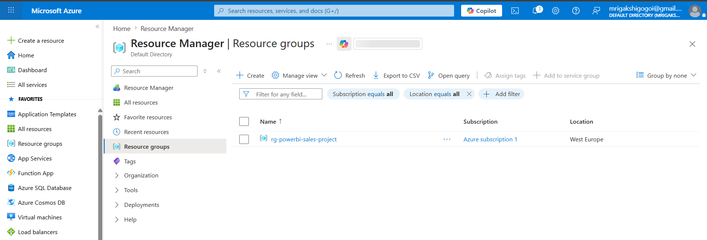

---

## Azure SQL Server

Logical SQL server created to host the Azure SQL Database.

**Server Name**

```text
sql-sales-mrigakshi
```

**Region**

```text
West Europe
```

### Screenshot

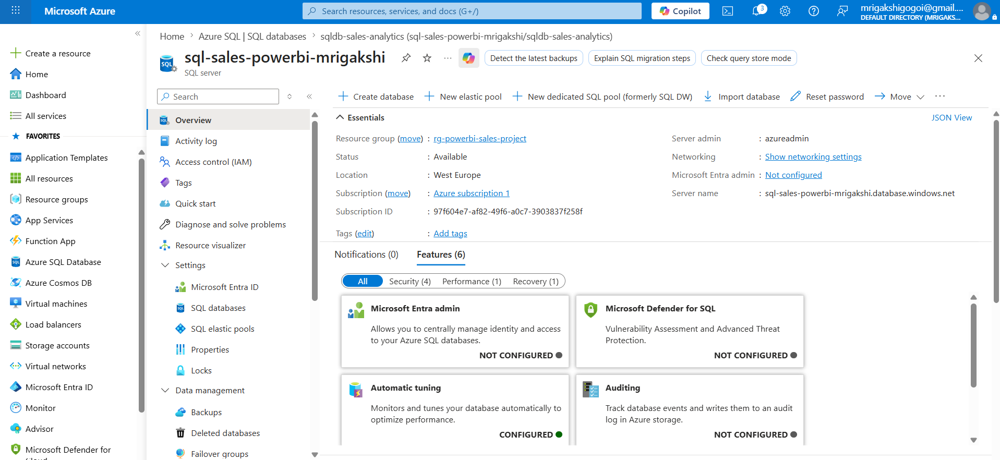

---

## Azure SQL Database

Azure SQL Database created for storing sales data.

**Database Name**

```text
sqldb-sales-analytics
```

### Screenshot

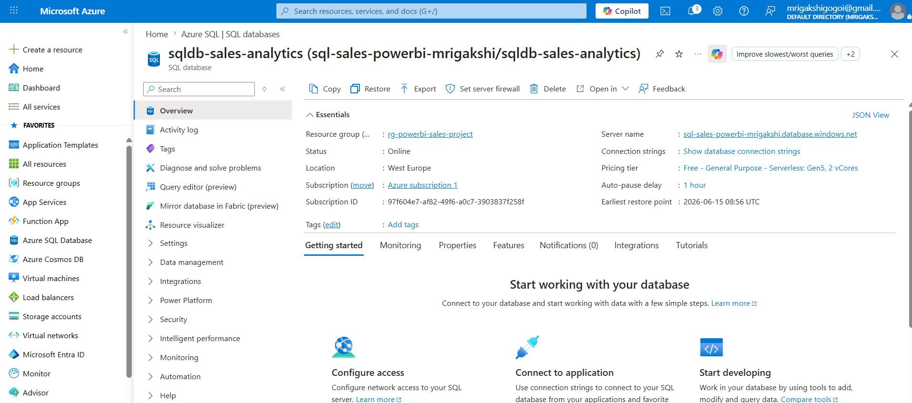

---

## Firewall Configuration

Network access configured to allow Azure services and local machine connectivity.

### Configuration

* Public Endpoint Enabled
* Azure Services Access Enabled
* Client IPv4 Address Added

### Screenshot

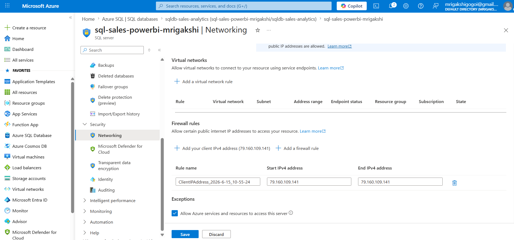

---

# Database Design

## Sales Table

A Sales table was created to store transactional sales information.

| Column         | Data Type     |
| -------------- | ------------- |
| OrderID        | INT           |
| OrderDate      | DATE          |
| CustomerName   | VARCHAR(100)  |
| Country        | VARCHAR(50)   |
| Product        | VARCHAR(100)  |
| Category       | VARCHAR(50)   |
| Quantity       | INT           |
| UnitPrice      | DECIMAL(10,2) |
| Revenue        | DECIMAL(10,2) |
| PaymentStatus  | VARCHAR(50)   |
| DeliveryStatus | VARCHAR(50)   |

### Screenshot

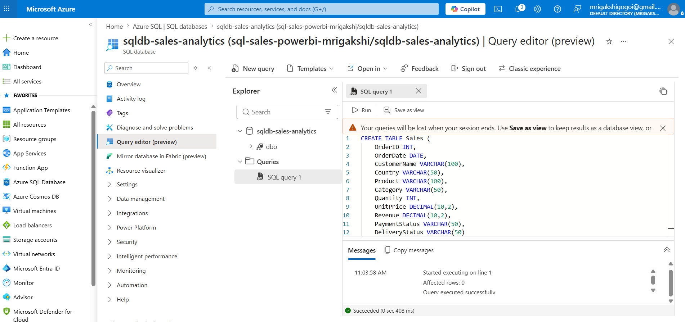

---

## Sample Data Insertion

Sample sales records were inserted into the Sales table for reporting and analytics.

### Screenshot

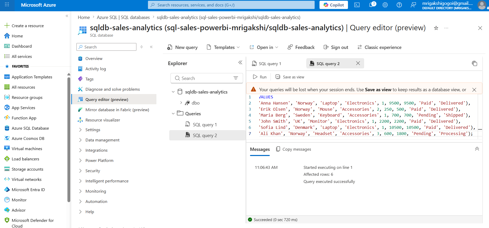

---

## Data Validation

A SQL query was executed to validate that the data was successfully inserted.

```sql
SELECT * FROM Sales;
```

### Screenshot

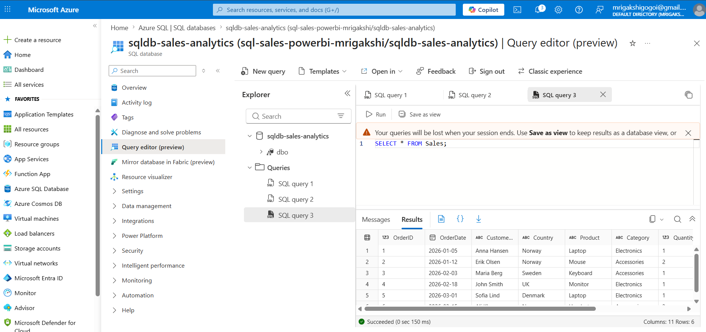

---

# Power BI Development

## Azure SQL Database Connection

Power BI Desktop was connected directly to Azure SQL Database.

### Screenshot

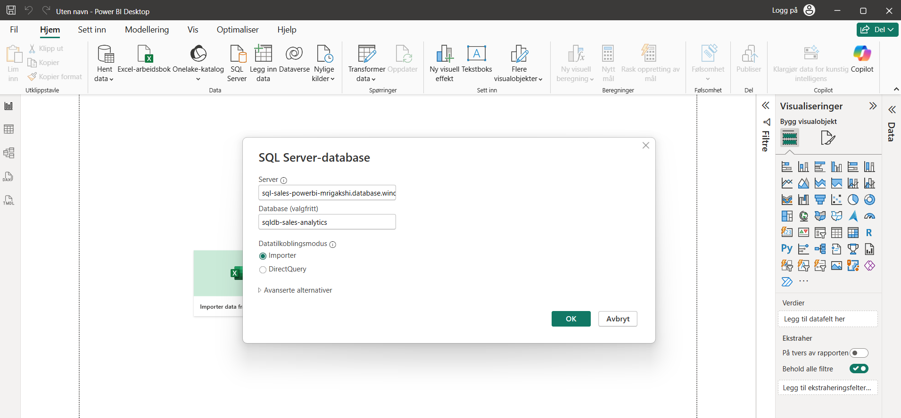
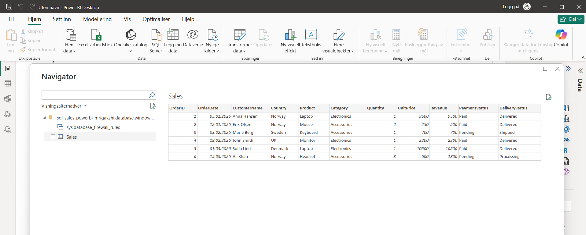

---

## Power Query Transformations

The dataset was validated and transformed using Power Query.

### Activities Performed

* Date formatting
* Data type validation
* Data cleansing
* Column verification

### Screenshot

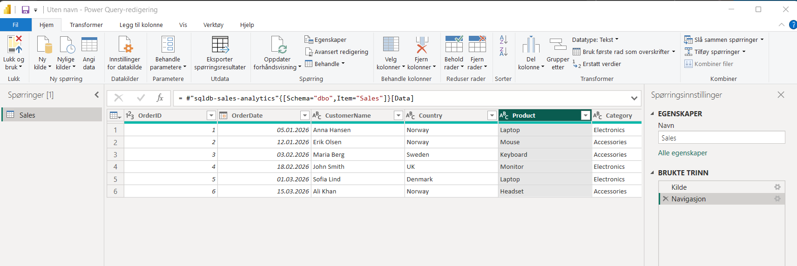

---

## DAX Measures Created

### Total Revenue

```DAX
Total Revenue = SUM(Sales[Revenue])
```

### Total Orders

```DAX
Total Orders = COUNT(Sales[OrderID])
```

### Average Order Value

```DAX
Average Order Value =
DIVIDE([Total Revenue], [Total Orders])
```

### Total Quantity Sold

```DAX
Total Quantity Sold =
SUM(Sales[Quantity])
```

### Screenshot

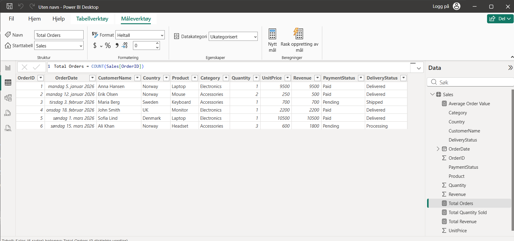

---

# Dashboard 1 — Sales Overview

## Objective

Provide a high-level summary of business performance.

### Visualizations

* Total Revenue
* Total Orders
* Average Order Value
* Revenue by Product
* Revenue by Country
* Monthly Revenue Trend

### Screenshot

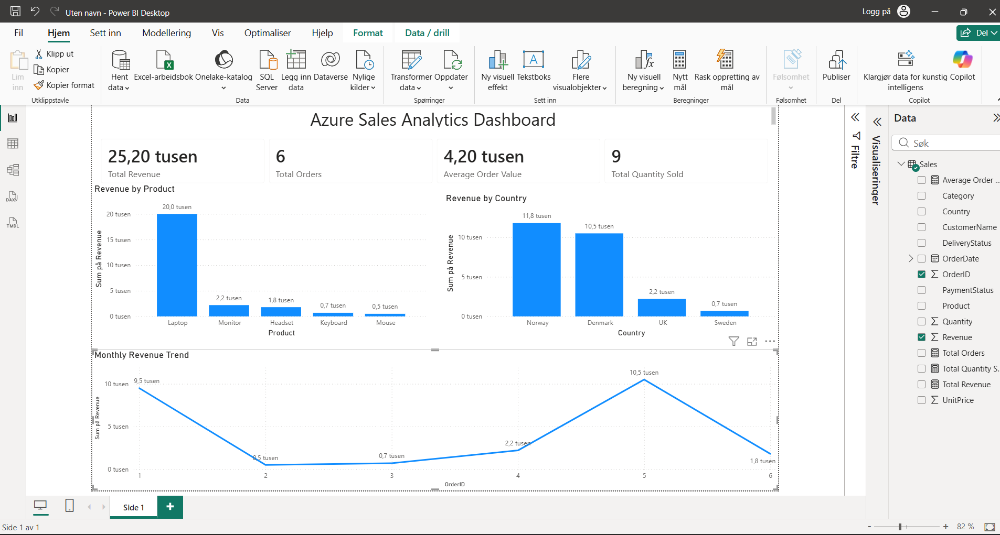

---

# Dashboard 2 — Product Performance

## Objective

Analyze product and category performance.

### Visualizations

* Revenue by Category
* Product Revenue Ranking
* Quantity Sold by Product
* Category Contribution

### Screenshot

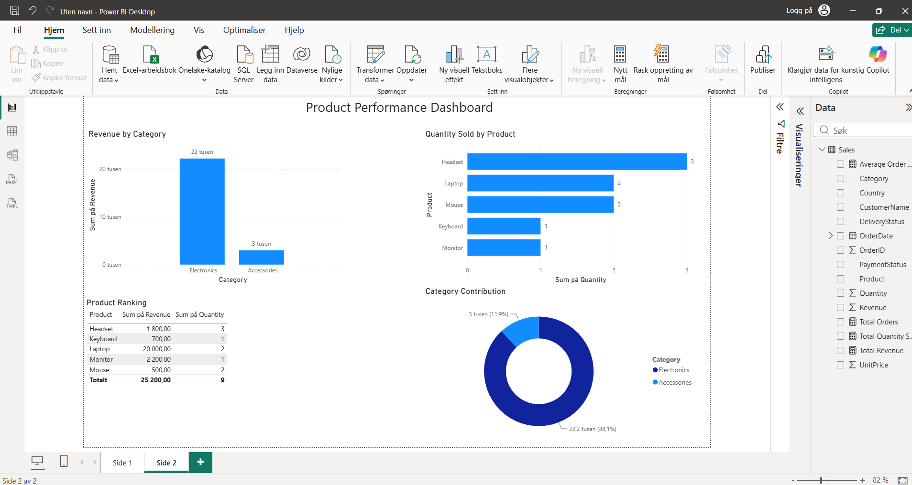

---

# Dashboard 3 — Customer & Operations Insights

## Objective

Understand customer activity and operational performance.

### Visualizations

* Revenue by Customer
* Revenue by Country
* Payment Status Distribution
* Delivery Status Distribution

### Screenshot

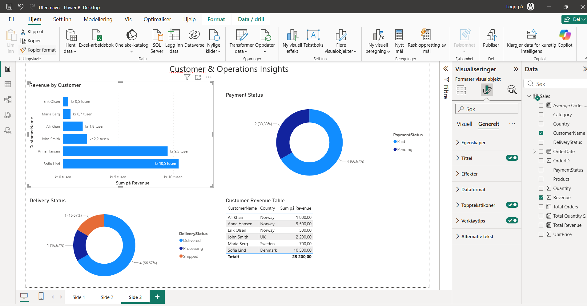

---

# Skills Demonstrated

## Azure

* Azure Resource Groups
* Azure SQL Database
* Azure SQL Server
* Firewall Configuration
* Cloud Resource Management

## SQL

* Table Creation
* Data Validation
* Data Querying
* Data Management

## Power BI

* Data Modeling
* Power Query
* DAX
* Dashboard Development
* KPI Reporting
* Data Visualization

## Business Analysis

* Data Interpretation
* Trend Analysis
* KPI Monitoring
* Operational Reporting

---

# Repository Structure

```text
powerbi-azure-sales-dashboard

│
├── README.md
│
├── dataset
│   └── sales-data.csv
│
├── sql
│   ├── create-sales-table.sql
│   └── insert-sales-data.sql
│
├── powerbi
│   └── sales-analytics-dashboard.pbix
│
├── screenshots
│   ├── 01-resource-group-created.png
│   ├── 02-sql-server-created.png
│   ├── 03-sql-database-created.png
│   ├── 04-firewall-configuration.png
│   ├── 05-sales-table-created.png
│   ├── 06-sales-data-inserted.png
│   ├── 07-sales-data-validation.png
│   ├── 08-powerbi-sql-connection.png
│   ├── 09-power-query-transformations.png
│   ├── 10-dax-measures-created.png
│   ├── 11-sales-overview-dashboard.png
│   ├── 12-product-performance-dashboard.png
│   └── 13-customer-operations-dashboard.png
│
└── docs
    └── project-summary.md
```

---

# Key Learning Outcomes

* Deploying Azure SQL Database resources
* Configuring Azure networking and firewall rules
* Creating and managing relational database tables
* Executing SQL queries in Azure
* Connecting Azure SQL Database to Power BI
* Building interactive dashboards and KPIs
* Creating DAX measures and business reports
* Publishing a complete analytics solution to GitHub
